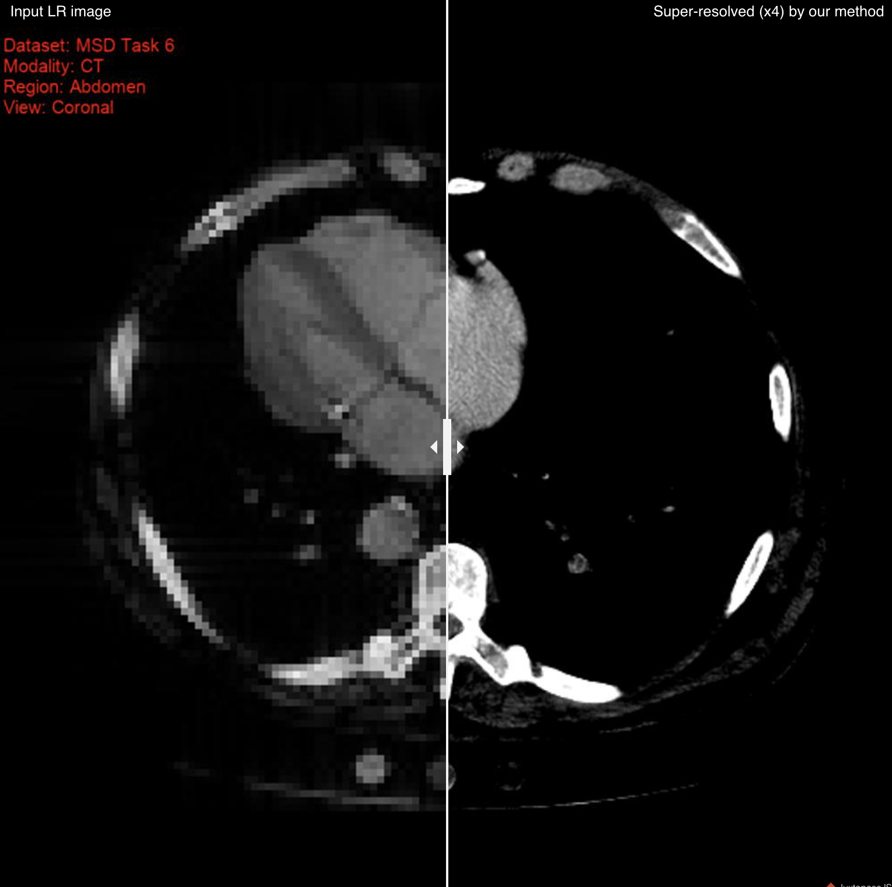

# 3D Volumetric Super-Resolution in Radiology Using 3D RRDB-GAN

Official code for **3D Volumetric Super-Resolution in Radiology Using 3D RRDB-GAN** (ISBI 2024). Our 3D RRDG-GAN + 2.5D Perception (3D-RRDBGANp) achieves super-resolving finer image quality across four different experiments including 4 modalities (T1/ T2 MRI, MRH, CT), 2 species (human, mouse), and 2 body regions (brain, abdomen).

Example output of our model:

## Usage
### Training:
#### GAN based method
    python train_srgan.py --exp_name rrdbgan_msd6_allviews
#### Non-GAN based method
    python train_sr.py --exp_name rrdbgan_msd6_allviews
You can change hyperparameters in the option scripts (store option script in `./options`) in yaml file format. For faster data I/O, I recommend using `--persistent_cache` option if there is enough storage for disk caching. Note that `exp_name` should be the filename of option script.

### Inference:
Not yet published. Will be updated soon.

### Data Structure:
    ./data
        - {data_source_name}
        - meta
            - {meta_json_for_data}.json
Note that `./data/meta/{meta_json_for_data}.json` should contain list of file locations stored in `./data/{data_source_name}` (see `./data/meta/msd_task06.json` as a reference). In option script, `data_opt-source` should have the same name as `{meta_json_for_data}`.

